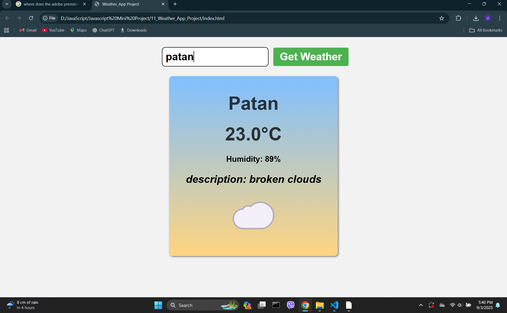

<h1>Output</h1>

  

<h3>IN THIS PROJECT I HAVE USE THE FOLLOWING CONCEPT OF JAVASCRIPT</h3>
<ul>
  <li>Dom Manipulation</li>
  <li>addEventLister</li>
  <li>Async/Await</li>
  <li>Try Catch Error</li>
  <li>API Fetch</li>
  <li>Switch Case</li>
</ul>