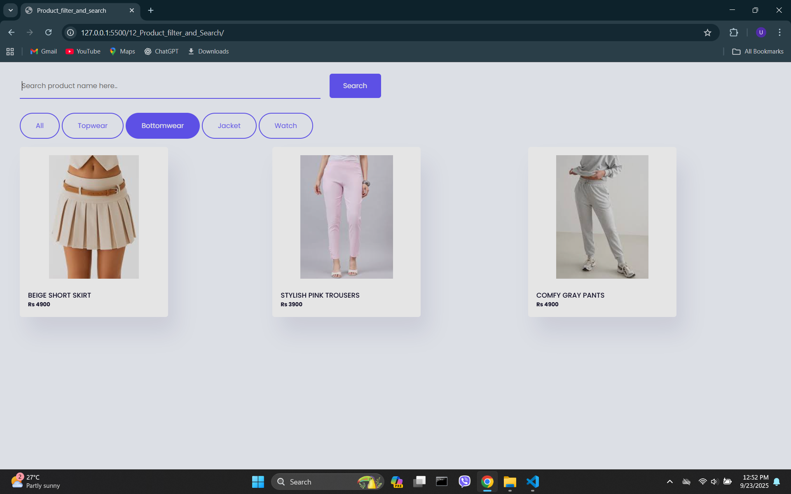

<h2>Output</h2>

  

<h3>CSS</h3>
<ul>
    <li>object-fit: contain;</li>
</ul>

<h3>JavaScript</h3>
<ul>
    <li>card.classList.add("card", i.category, "hide");</li>
    <li>image.setAttribute("src", i.image);</li>
    <li>window.onload</li>
    <li>element.classList.contains(value)</li>
    <li>elements.forEach((element, index) => {})</li>

</ul>
